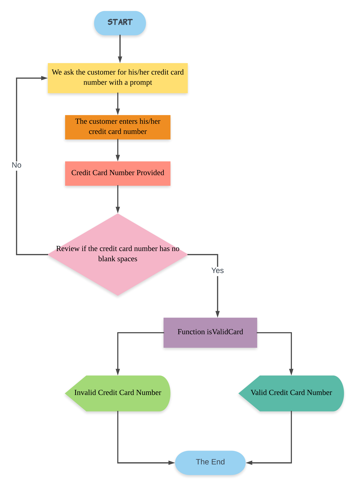

# CREDIT CARD NUMBER 

### Descripción: 

Crea una web que pida, por medio de un prompt(), el número de una tarjeta de crédito y confirme su validez según el algoritmo de Luhn. 

Consideraciones Específicas

Tu código debe estar compuesto por una función: isValidCard.
El usuario no debe poder ingresar un campo vacío.

## Pseudocódigo:
### Descripción:
En esta parte se describe la funcionalidad del proyecto descrito en pasos. 

1. Preguntarle al cliente cuál es el número de su tarjeta de crédito. 

2. Revisar que el número de la tarjeta de crédito no contenga espacios.

3. Establecer una función que verifique la validez de la tarjeta a través del algoritmo de Luhn. El cuál necesita cuatro pasos fundamentales.
* Los números que se encuentran en la posición par deben multiplarse por dos. Y así se crea una nueva línea con nuevos dígitos.
* Los dígitos de las cifras que sean mayores o iguales a diez deben sumarse. Ej. El 12, 1 + 2 = 3. Se vuelve a crear una nueva línea con nuevos dígitos. 
* Ahora se suman todos los números de la línea. 
* El resultado de la suma se divide entre diez y si el residuo es 0, se considera el número como válido, de lo contrario es inválido.

4. Una vez sabiendo el resultado se le debe mostrar al usuario cuál fue éste. 

## Diagrama de flujo:

